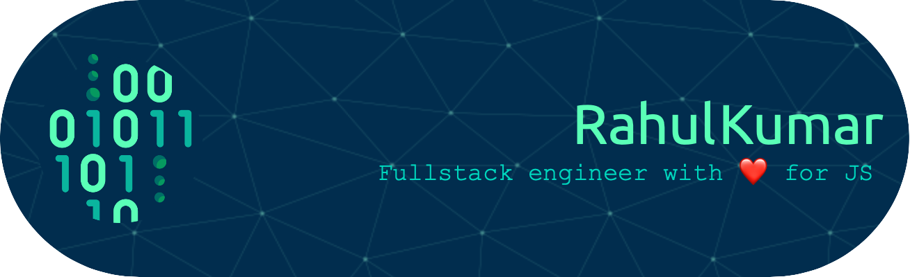

<h1 align="center">Hi 👋, I'm Rahul Kumar</h1>
<h3 align="center">I'm a fullstack engineer with ❤️ for JavaScript</h3> 

<a href='https://twitter.com/idevwise' target='_blank'>

- 🌱 I’m currently learning `Python` and `Prompt Engineering using Python`.
- 💬 Ask me about: JavaScript, Leadership, Career Counselling, System Design, and Full-Stack Development in general.
  
<!--
**idevwise/idevwise** is a ✨ _special_ ✨ repository because its `README.md` (this file) appears on your GitHub profile.

Here are some ideas to get you started:

- 🔭 I’m currently working on ...
- 🌱 I’m currently learning ...
- 👯 I’m looking to collaborate on ...
- 🤔 I’m looking for help with ...
- 💬 Ask me about ...
- 📫 How to reach me: ...
- 😄 Pronouns: ...
- ⚡ Fun fact: ...
-->
### Blogs posts
<!-- BLOG-POST-LIST:START -->
- [Skin in the Game: A Roadmap for Engineering Leaders To Find Meaning in Work](https://devwise.in/skin-in-the-game)
- [A Beginner's Guide to DNS](https://devwise.in/a-beginners-guide-to-dns)
- [Temporal Scoping in JavaScript](https://devwise.in/temporal-scoping)
<!-- BLOG-POST-LIST:END -->

### Some Stats
<!-- Stats Start -->

 

&nbsp;
&nbsp;

<!-- Stats End -->

 

